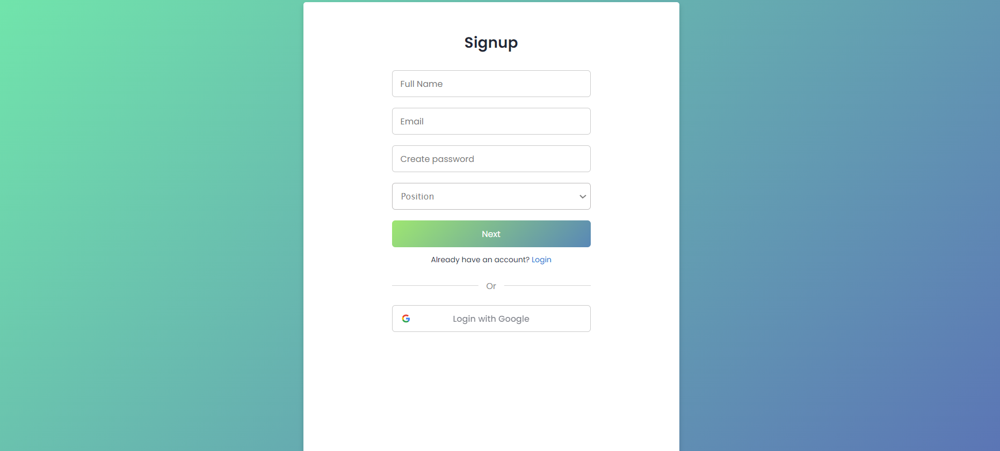
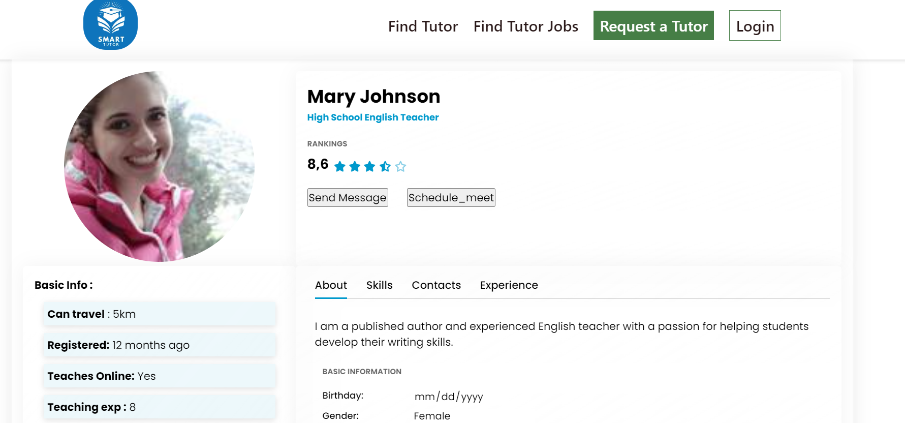
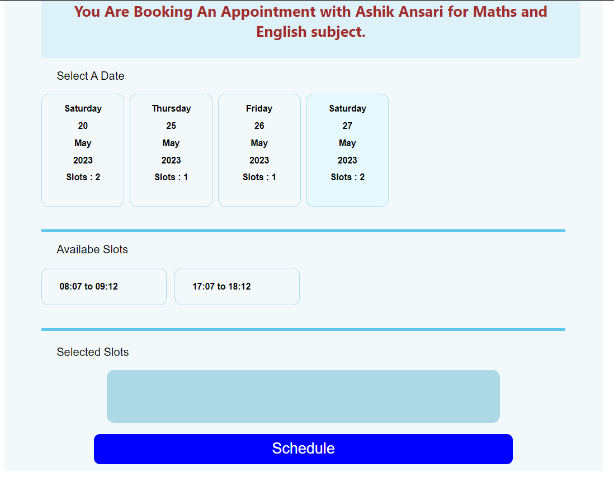
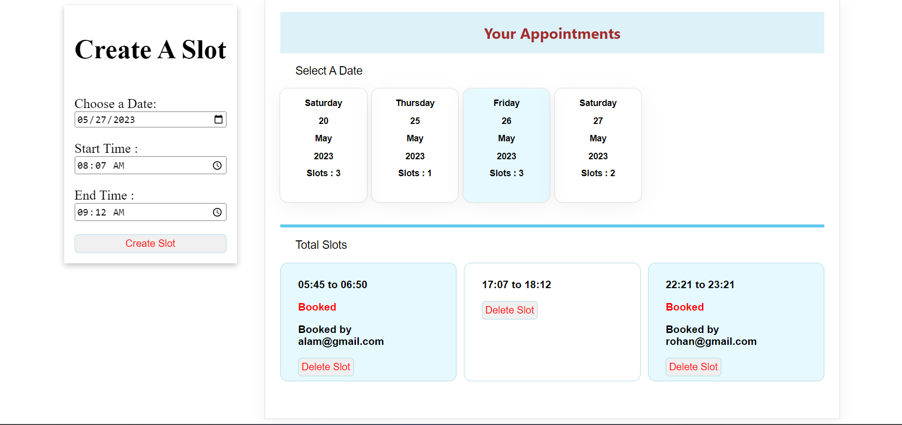

# Tutoring Appointment Booking Application


<span style="font-size:20px">This is a web application that allows tutors and students to register themselves. Students can book appointments with tutors for a particular subject. Additionally, an admin user can manage the system, including the ability to ban students or teachers.</span>

Deployed Link : https://sparkling-medovik-da7bd0.netlify.app/
<br/>
Backend Link : https://dull-cyan-jellyfish-cuff.cyclic.app/

## 

<span>**\*\***\*\***\*\***-----------------------------------\***\***\*\***\*\***<span>

## Features

The application has the following features:

- Tutors can register themselves and provide information about their qualifications, experience, and hourly rates.

* Students can register themselves and search for tutors based on subject and availability.
* Students can book appointments with tutors and view their upcoming appointments.
* Tutors can view their upcoming appointments and mark them as completed when finished.
* Admin users can manage the system, including the ability to ban students or tutors, view all appointments, and view all users.

## Technologies Used

The application is built using the following technologies:

- Node.js: a JavaScript runtime for building server-side applications
- Express: a minimal and flexible web application framework for Node.js
- MongoDB: a NoSQL document database for storing application data
- HTML, CSS and JavaScript for building the user interfaces.

<span>**\*\***\*\***\*\***-----------------------------------\***\***\*\***\*\***<span>

# SmartTutor API documentation

- This repository contains API documentation for SmartTutor

## 1. Overview

- Basic API endpoint = `https://dull-cyan-jellyfish-cuff.cyclic.app/`.
- All requests must be secure, i.e. `https`, not `http`.

## 2. Authentication

- This API uses Role based authrization.
- In order to perform user or admin operations, Token is required.
- Token can be obtained by creating account and logging in to the system.
- No saperate login routes for users, Tutors and admins.
- System Redirects users/admins to respective locations i.e, users landing page or admin page according to user role in DB.

## (i). User

- Registration



- URL: `https://dull-cyan-jellyfish-cuff.cyclic.app/register`
- Method: POST
- Parameters:

```

{
    name: string (required),
    email: string (required),
    password: user_password (5 characters or more) (required),
    role: (teacher or default user)
}
```

- Responses

  - 200 (Ok): `{msg: "Successfully Registered!"}}`
  - 409 (account already exists): `{"msg": "user exists"}`
  - 400 (error in hashing): `{"msg": "Error while hashing the password"}`
  - 500 (error): `{"msg": "Something went wrong"}`

- Login

  - URL: `https://dull-cyan-jellyfish-cuff.cyclic.app/login`
  - Method: POST
  - Parameters:

  ```
  {
      email: string (required),
      password: user_password (required)
  }
  ```

  - Responses
    - 200 (Ok): `{msg: Login successful, token: token, email: email,data:data}`
    - 401 (account does not exists): `{"msg": "Wrong Credentials"}`
    - 404 (missing credentails): `{"msg": "User not found!"}`
    - 500 (some error): `{"msg": "Something went wrong!"}`

- Check Providers

  - URL: `https://dull-cyan-jellyfish-cuff.cyclic.app/teachers/all`
  - Method: GET
  - Parameters: none
  - Response: `[...tutor's data]`

- Get the details about a particular teacher



- URL: `https://dull-cyan-jellyfish-cuff.cyclic.app/teachers/one`
- Method: GET
- Parameters: {
  teacher_id:string(required)
  }
- Response: `[one tutor's data]`

- Check Slots of a tutor



- URL: `https://dull-cyan-jellyfish-cuff.cyclic.app/slot/one-tutor/all/${id}`
- Method: GET
- Parameters: {
  teacher_id : string(required)
  }
- Response: `[slot's data of a particular teacher]`
  `

- Book Appointment

  - URL: `https://dull-cyan-jellyfish-cuff.cyclic.app/slot/book/${slotID}`
  - Method: PATCH
  - Parameters:

  ```
  {
      token: string (required),
      slotId: string (required),
      studentEmail: string (required)
  }
  ```

  - Responses:

````
    - 200 (Ok): {  msg: `Slot having id ${slotId} is booked !!`,

      bookedSlot:

      ```
      {
       dateMonthName: data.dateMonthName,
       slot_timing: data.slot_timing,
       isBooked: true,
       tutorEmail: data.userEmail,
       studentEmail: req.body.studentEmail,
      }`


     } ```

    - 401 (missing credentails): `{"msg": msg: "Student Email is missing.""}
    - 404 (Not found) : `{msg: Slot Not available}`
    - 500 (some error): `{msg: "Something went Wrong while booking of the slot !"}`

````

## (ii). Tutor

- Get All Slots

  

  - URL: `https://dull-cyan-jellyfish-cuff.cyclic.app/slot/one-tutor/all/${id}`
  - Method: GET

  - Parameters:

```

        {
          teacher_id : string(required)
          slot_id : string(required)
        }

```

- - Responses:

  - 200 (Ok): { msg: `Slot having id ${slotId} is booked !!`,

  bookedSlot:

  ````
  {
   dateMonthName: data.dateMonthName,
   slot_timing: data.slot_timing,
   isBooked: true,
   tutorEmail: data.userEmail,
   studentEmail: req.body.studentEmail,
  }`


  } ```

  ````

- 401 (missing credentails): `{"msg": msg: "Student Email is missing.""}
- 404 (Not found) : `{msg: Slot Not available}`
- 500 (some error): `{msg: "Something went Wrong while booking of the slot !"}`

- Create Slot

  - URL: `https://dull-cyan-jellyfish-cuff.cyclic.app/slot/create`
  - Method: POST

  - Parameters:
    {
    userEmail : string(required),
    dateMonthName : string(required),
    slot_timing : string(required),
    isBooked : string(required),
    studentEmail : string(required),
    }

  - Responses:

- 200 (Ok): {msg: `Slot Created for ${dateMonthName}, from ${slot_timing[0]} to ${slot_timing[1]} ! `}
- 500 (some error):
  {
  {
  msg: "Some Error in creating the slot",
  error: error.message,
  }
  }

{
dateMonthName: data.dateMonthName,
slot_timing: data.slot_timing,
isBooked: true,
tutorEmail: data.userEmail,
studentEmail: req.body.studentEmail,
}`

- Delete A Slot

- URL: `https://dull-cyan-jellyfish-cuff.cyclic.app/slot/delete/${slotID}`
- Method: DELETE
- Parameters:

{

    slotId: string (required),
    teacher_id: string (required)

}

-Responses:
{

    msg: `Slot deleted !!`,
    deletedSlot: {
      dateMonthName: deletedSlot.dateMonthName,
      slot_timing: deletedSlot.slot_timing,
    },

}

```

```
